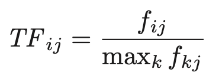

# Chapter 1 Data mining 
From the book Mining of Massive Datasets

## What is Data mining?
> "definition of “data mining” is the discovery of “models” for data."

A “model,” however, can be one of several things

### Statical modeling
> "statisticians view data mining as the **construction** of a statistical model, that is, an underlying distribution from which the visible data is drawn." 

Example:
* A statistician might decide that the data comes from a Gaussian distribution and use a formula to compute the most likely parameters of this Gaussian.

### Machine Learning

#### When to use ML
> "The typical case where machine learning is a good approach is **when we have little idea of what we are looking for in the data.**"

Example:
* It is rather unclear what it is about movies that makes certain movie-goers like or dislike it.

#### When not to use ML
However
> "machine learning has not proved successful in situations where we can describe the goals of the mining more directly."

Example:
* Use machine learning to locate people’s resumes on the Web. It was not able to do better than algorithms designed by hand to look for some of the obvious words and phrases that appear in the typical resume. Since everyone who has looked at or written a resume has a pretty good idea of what resumes contain, there was no mystery about what makes a Web page a resume.

### Computational Approaches to Modeling
> "computer scientists have looked at data mining as an algorithmic problem.
> In this case, the model of the data is simply the **answer** to a **complex query** about it."

Most other approaches to modeling can be described as either
1. Summarizing the data succinctly and approximately, or
2. Extracting the most prominent features of the data and ignoring the rest.

### Feature Extraction
Some of the important kinds of feature extraction from large-scale data that we shall study are:
1. **Frequent Itemsets**: makes sense for data that consists of “baskets” of small sets of items. We look for small sets of items that appear together in many baskets, and these “frequent itemsets” are the characterization of the data that we seek.
   * *Example*: the sets of items, such as hamburger and ketchup, that people tend to buy together when checking out at the cash register of a store or super market
2. **Similar items**: the objective is to find pairs of sets that have a relatively large fraction of their elements in common.
   * *Example*: treating customers at an on- line store like Amazon as the set of items they have bought. In order for Amazon to recommend something else they might like, Amazon can look for “similar” customers and recommend something many of these customers have bought.
   * This process is called “collaborative filtering.”
   * it is more useful to find, for each customer, a small number of other customers who are similar in their tastes, and represent the data by these connections.

## Statistical Limits on Data Mining
> A common sort of data-mining problem involves discovering unusual events hidden within massive amounts of data.

### Total Information Awareness
> In 2002, the Bush administration put forward a plan to mine all the data it could find, including credit-card receipts, hotel records, travel data, and many other kinds of information in order to track terrorist activity. This idea naturally caused great concern among privacy advocates, and the project, *called TIA, or Total Information Awareness*.

The concern raised by many is that if you look at so much data, and you try to find within it activities that look like terrorist behavior, are you not going to find many innocent activities – or even illicit activities that are not terrorism – that will result in visits from the police and maybe worse than just a visit?

### Bonferroni’s Principle
Suppose you have a certain amount of data, and you look for events of a certain type within that data. You can expect events of this type to occur, even if the data is completely random, and *the number of occurrences of these events will grow as the size of the data grows.* These occurrences are **“bogus,”** in the sense that they have no cause other than that random data will always have some number of unusual features that look significant but aren’t.

> Bonferroni’s principle, that helps us avoid treating random occurrences as if they were real. Calculate the expected number of occurrences of the events you are looking for, on the assumption that data is random. If this number is signifi- cantly larger than the number of real instances you hope to find, then you must expect almost anything you find to be bogus, i.e., a statistical artifact rather than evidence of what you are looking for.

Example with TIA:
* In a situation like searching for terrorists, where we expect that there are few terrorists operating at any one time, Bonferroni’s principle says that we may only detect terrorists by looking for events that are so rare that they are unlikely to occur in random data.

## Things Useful to Know

### Importance of Words in Documents
The formal measure of how concentrated into relatively few documents are the occurrences of a given word is called **TF.IDF** (Term Frequency times In- verse Document Frequency).

Suppose we have a collection of $N$ documents. Define $f_{ij}$ to be the frequency (number of occurrences) of term (word) $i$ in document $j$. 
Then, define the term frequency
$TF_{ij}$ to be:

That is, the term frequency of term $i$ in document $j$ is $f_{ij}$ normalized by dividing it by the maximum number of occurrences of any term (perhaps excluding stop words) in the same document. Thus, the most frequent term in document $j$ gets a TF of 1, and other terms get fractions as their term frequency for this document.

The **IDF** for a term is defined as follows. 
Suppose term $i$ appears in $n_i$ of the $N$ documents in the collection. 
Then $IDF_i = log_2(N/n_i)$. 

The TF.IDF score for term $i$ in document $j$ is then defined to be:
$TF_{ij} \times IDF_i$. 
The terms
with the highest TF.IDF score are often the terms that best characterize the
topic of the document.

* The TF.IDF measure of word importance.
* we shall be faced with the problem of categorizing documents (sequences of words) by their topic.

> Classification often starts by looking at documents, and finding the significant words in those documents.
> The most frequent words will most surely be the common words such as “the” or “and,” which help build ideas but do not carry any significance themselves. In fact, the several hundred most common words in English (called stop words) are often removed from documents before any attempt to classify them.

## Summary
* **Data Mining**: This term refers to the process of extracting useful models of data. Sometimes, a model can be a summary of the data, or it can be the set of most extreme features of the data.
* **Bonferroni’s Principle**: If we are willing to view as an interesting fea- ture of data something of which many instances can be expected to exist in random data, then we cannot rely on such features being significant. This observation limits our ability to mine data for features that are not sufficiently rare in practice.
* **TF.IDF**: The measure called TF.IDF lets us identify words in a collection of documents that are useful for determining the topic of each document. A word has high TF.IDF score in a document if it appears in relatively few documents, but appears in this one, and when it appears in a document it tends to appear many times.
* **Hash Functions**: A hash function maps hash-keys of some data type to integer bucket numbers. A good hash function distributes the possible hash-key values approximately evenly among buckets. Any data type can be the domain of a hash function.
* **Indexes**: An index is a data structure that allows us to store and retrieve data records efficiently, given the value in one or more of the fields of the record. Hashing is one way to build an index.
* **Storage on Disk**: When data must be stored on disk (secondary memory), it takes very much more time to access a desired data item than if the same data were stored in main memory. When data is large, it is important that algorithms strive to keep needed data in main memory.
* **Power Laws**: Many phenomena obey a law that can be expressed as
$y = cx^a$ for some power $a$, often around $−2$. Such phenomena include the
sales of the $x$th most popular book, or the number of in-links to the $x$th
most popular page.
