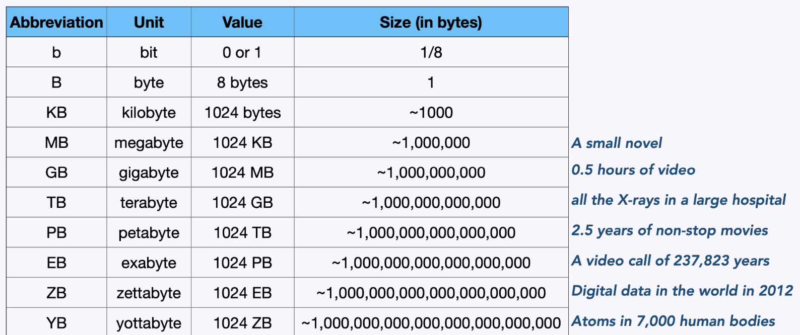

# Lecture 1 - Big data management

## Advancements in hardware
* **CPU**
* **GPU**
**TPU**: Tensor processing unit is an AI accelerator, that is a chip designed for a specific purpose: running matrix and vector based mathematics 

## Big data
> **3 V's of big data**:
> Big data is **high-volume**, **high-velocity**, and/or **high variety** information assets that demand cost-effective, innovative forms of information processing that *enable enhanced insight, decsion making, and process automation*.

Challenges related to big data? 
* Storage
* Environmental impact
* Processing - network and latency
* What hardware to use?
* How to analyse it?

### High volume data
> In short: **Amount of data**

> In big data we refer to it in terms of **TB**, it depends on the data we have and **stored**.

### High velcity data
> In short: **Speed of data generation**

> How to process and transfering/distribution of data.

Example: Cern particel collider research center.

LHC (large hadron collider) computing grid:

**What is a computing grid?**
Distributed computing paradigm with:
* Shared heterogeneous computational resources across multiple (geographic disperse) administrative domains loosely coupled over network and controlled centrally (but not managed!)
* Distributed users of Virtual Organizations (VO) with a common access interface
* **Goal**: Collaboration on complex (compute) projects across different geographic and institutional boundaries to solve a common large-scale problem 

### High variety data
> In short: **Diversity of data**. Different forms of data

#### The impact of AI

**Example**: It could be the differenct content a company provide, like youtube have a lot of different videos. Health monitors that monitor different things in your body. 

## More V's of Big Data
* **Voulme**: Amount of data
* **Variety**: Diversity if data
* **Velocity**: Speed og data generation
* **Veracity**: Accuracy of data
* **Value**: Worth of data

