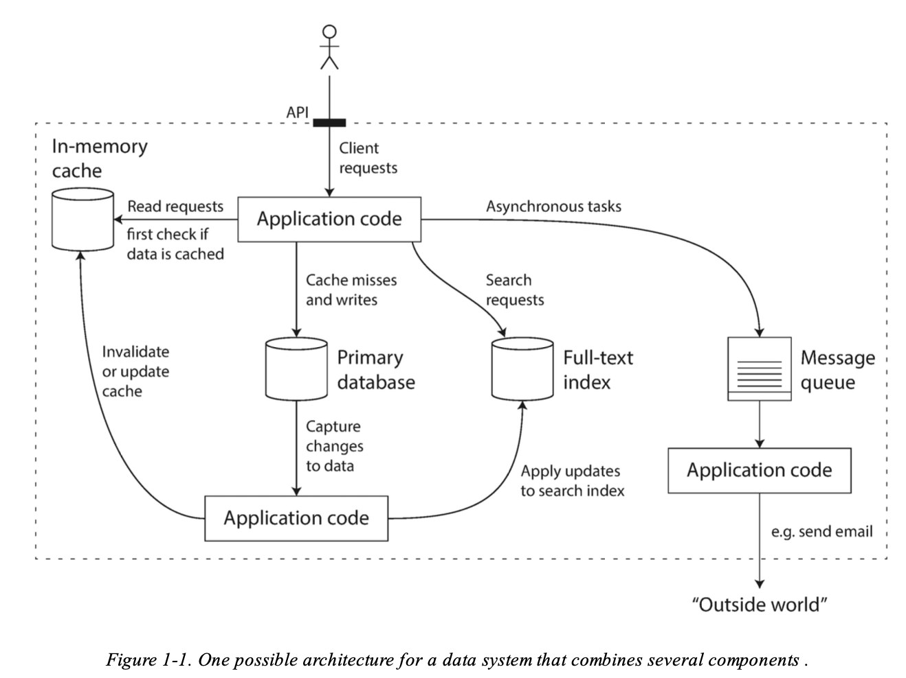
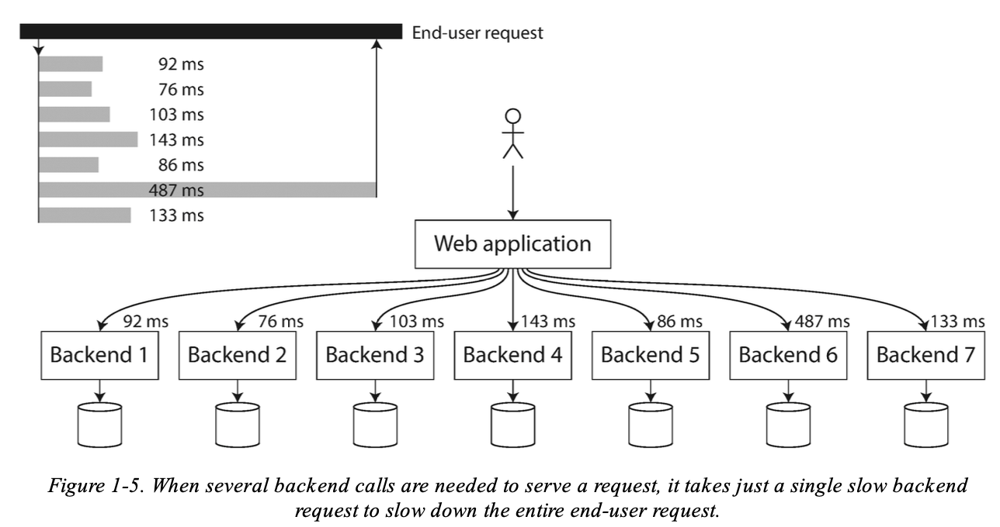

# Chapter 1. Reliable, Scalable, and Maintainable Applications
Designing data intensive applications.

## Keywords
**Reliability**: 
* Tolerating hardware and software faults
* Human error
* > The system should continue to work *correctly* (performing the correct function at the desired level of performance) even in the face of *adversity* (hardware or software faults, and even human error).

**Scalability**:
* Measuring load and performance
* Latency percentiles
* Throughtput
* > As the system *grows* (in data volume, traffic volume, or complexity), there should be reasonable ways of dealing with that growth.

**Maintainability**:
* Operability
* Simplicity and evolvability
* > Over time, many different people will work on the system (engineering and operations, both maintaining current behavior and adapting the system to new use cases), and they should all be able to work on it *productively*.

> Many applications today are *data-intensive* , as opposed to *compute-intensive* . Raw CPU power is rarely a limiting factor for these applications — bigger **problems** are usually the **amount of data**, the **complexity of data**, and the **speed at which it is changing**.

Many applications need:
* **Databases**: Store data.
* **Caches**: Remember results of an expensive operation.
* **Search indexes**: Allow users to search data by keyword or filter it in different ways.
* **Stream processing**: Send a messege to another process, to be handled asynchronously.
* **Batch processing**: Periodically crunch a large amount of accumulated data.

## Thinking about data systems
> A lot of new tools for data sotrage and proccessing have emerged in recent years, and optimizes for different use cases, and no longer fit into traditional categories.
>
> Also, increasingly many applications now have such demanding or wide-ranging requirements that **a single tool can no longer** meet all of its data processing and storage needs.

The application programming interface (API) usually **hides** those implementation details from clients.
* Hence a new speacial purpose data system from smaller general purpose components is created.

## Reliability
> “continuing to work correctly, even when things go wrong.”

**Fault vs failure**:
* A **fault** is usually defined as one component of the system deviating from its spec.
* A **failure** is when the system as a whole stops providing the required service to the user

### Hardware faults
> Hard disks crash, RAM becomes faulty, the power grid has a blackout, someone unplugs the wrong network cable.
>
> these things happen all the time when you have a lot of machines...

**Response**
* Add redundancy, by setting up either
  * A RAID configuration
  * Dual power supllies
  * Hot swappable CPUs
  * Backup battires and diesel generators for backup power for datacenters.

**Advantages**:
* A *single-server system* requires planned downtime if you need to reboot the machine (to apply operating system security patches, for example).
* A *rolling upgrade system* can tolerate machine failure by patching one node at a time, without downtime of the entire system.

### Software erros
> Bugs that causes crashes if given bad input, using up shared resources (CPU time, memory, disk space, or network bandwidth), service slows downs (becomes unresponsive or returns corrupted responses), or cascading failures where a small fault triggers a fault in another component, which could start a chain of faults.

**Response**
* carefully thinking about assumptions and interactions in the system
* apply testing
* process isolation
* allowing processes to crash and restart
* add measuring or monitoring to analyze system behavior in production.

### Human errors
> Humans build the software systems and operates them. They are known to be unreliable.

**Response**
* Design systems in a way that minimizes opportunities for error.
* Decouple the places where people make the most mistakes from the places where they can cause failures.
* Test thoroughly at all levels, from unit tests to whole-system integration tests and manual tests.
* Allow quick and easy recovery from human errors, to minimize the impact in the case of a failure. 
* Set up detailed and clear monitoring, such as performance metrics and error rates.
* Implement good management practices and training

## Scalability
> a system’s ability to cope with increased load

> Even if a system is working reliably today, that doesn’t mean it will necessarily work reliably in the future.
>
> Perhaps the system has grown from 10,000 concurrent users to 100,000 concurrent users, or from 1 million to 10 million.
> Perhaps it is processing much larger volumes of data than it did before.

**Latency and response time**
* The **response time** is what the client sees: besides the actual time to process the request (the service time ), it includes network delays and queueing delays. 
* **Latency** is the duration that a request is waiting to be handled — during which it is latent , awaiting service

**Percentiles**
If you take your list of response times and sort it from fastest to slowest, then the median is the halfway point: for example, if your median response time is 200 ms, that means half your requests return in less than 200 ms, and half your requests take longer than that.
* The median is also known as the 50th percentile , and sometimes abbreviated as p50.
* In order to figure out how bad your outliers are, you can look at higher percentiles: the 95th , 99th , and 99.9th percentiles are common (abbreviated p95 , p99 , and p999).

> Even if only a small percentage of backend calls are slow, the chance of getting a slow call increases if an end-user request requires multiple backend calls, and so a higher proportion of end-user requests end up being slow (an effect known as tail latency amplification).

> For example, Amazon describes response time requirements for internal services in terms of the 99.9th percentile, even though it only affects 1 in 1,000 requests. This is because the customers with the slowest requests are often those who have the most data on their accounts because they have made many purchases — that is, they’re the most valuable customers. It’s important to keep those customers happy by ensuring the website is fast for them.

### How to apply scalability
* **Vertical scaling/scaling up**: moving to a more powerful machine.
* **Horizontal scaling/scaling out**: distributing the load across multiple smaller machines.
  * Also known as shared-nothing architecture.
* Some systems are elastic , meaning that they can automatically add computing resources when they detect a load increase.
  * Usefull if load is highly unpredictable, but manually scaled systems are simpler and may have fewer operational surprises.

## Maintainability
>  fixing bugs, keeping its systems operational,investigating failures, adapting it to new platforms, modifying it for new use cases, repaying technical debt, and adding new features.

### Operability
> “good operations can often work around the limitations of bad
(or incomplete) software, but good software cannot run reliably with bad operations”

Good operation team:
* Tracking down cause of problems
* Monitoring the health of the system
* Anticipate future problems and solve them before they occur
* Use good practices and tools for deployment
* Mantain the security of the system

Good operability:
* Providing visibility into the runtime behavior and internals of the system, using monitoring.
* Providing good support for automation and integration with standard tools
* Avoiding dependency on individual machines
* Documentation
* Providing good default behavior, but also giving administrators the freedom to override defaults when needed
* Self-healing where appropriate
* Exhibiting predictable behavior, minimizing surprises

### Simplicity
> Managing complexity

One of the best tools we have for removing accidental complexity is **abstraction**.

### Evolvability
> Making change easy

It’s extremely unlikely that your system’s requirements will remain unchanged forever.

**Agile** working patterns provide a framework for adapting to change.