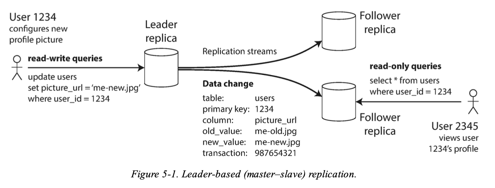
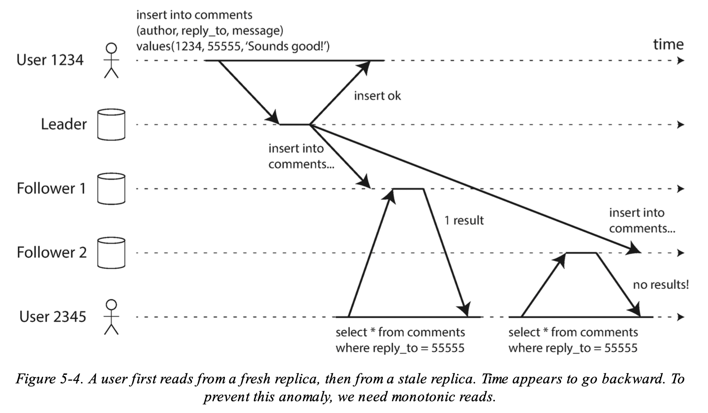
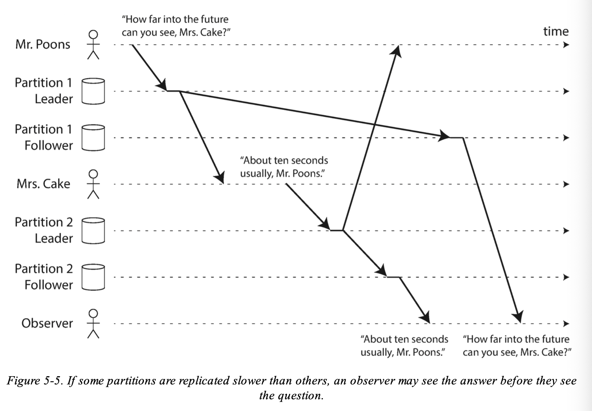

# Chapter 5 - Replication
Designing data intensive applications.

**Replication vs Partitioning**
**Replication**
* Keeping a copy of the same data on several different nodes, potentially in different locations. Replication provides redundancy: if some nodes are unavailable, the data can still be served from the remaining nodes. Replication can also help improve performance.
**Partitioning**
* Splitting a big database into smaller subsets called partitions so that different partitions can be assigned to different nodes (also known as sharding).

## Replications
There are several reasons why you might want to replicate data:
* To keep data geographically close to your users (and thus reduce latency)
* To allow the system to continue working even if some of its parts have failed (and thus increase availability)
* To scale out the number of machines that can serve read queries (and thus increase read throughput)

## Leaders and followers
Each node that stores a copy of the database is called a **replica**.

Used as a built-in feature of many relational databases, such as
PostgreSQL, MySQL, Oracle Data Guard. Also used in nonrelational databases such as, MongoDB, RethinkDB, and Espresso.

It works as follows:
1. One of the replicas is designated the leader (also known as master or primary). When clients want to write to the database, they must send their requests to the leader, which first writes the new data to its local storage.
2. The other replicas are known as followers (read replicas , slaves , secondaries , or hot standbys). Whenever the leader writes new data to its local storage, it also sends the data change to all of its followers as part of a *replication log* or *change stream*. Each follower takes the log from the leader and updates its local copy of the database accordingly, by applying all writes in the same order as they were processed on the leader.
3. When a client wants to read from the database, it can query either the leader or any of the followers. However, writes are only accepted on the leader (the followers are read-only from the client’s point of view).

### Synchronous Versus Asynchronous Replication

**Synchronous replications**
Advantage:
* the follower is guaranteed to have an up-to-date copy of the data that is consistent with the leader.
* If the leader suddenly fails, we can be sure that the data is still available on the follower.
Disadvantage:
* if the synchronous follower doesn’t respond (because it has crashed, or there is a network fault, or for any other reason), the write cannot be processed. The leader must block all writes and wait until the synchronous replica is available again.

In practice:
* If you enable synchronous replication on a database, it usually means that **one of the followers is synchronous**, and the others are asynchronous. 
* If the synchronous follower becomes unavailable or slow, one of the asynchronous followers is made synchronous.
* guarantees that you have an up-to-date copy of the data on at least two nodes: the leader and one synchronous follower. 
* This configuration is sometimes also called *semi-synchronous*

**Asynchronous replication**
* Often, leader-based replication is configured to be completely asynchronous.
* if the leader fails and is not recoverable, any writes that have not yet been replicated to followers are lost. This means that a write is not guaranteed to be durable, even if it has been confirmed to the client. 
* However, a fully asynchronous configuration has the advantage that the leader can continue processing writes, even if all of its followers have fallen behind.

### Setting up new followers
From time to time, you need to set up new followers — perhaps to increase the number of replicas, or to replace failed nodes.

Simply copying data files from one node to another is typically not sufficient: clients are constantly writing to the database, and the data is always in flux.

Conceptually, the process looks like this:
1. Take a consistent snapshot of the leader’s database at some point in time — if possible, without taking a lock on the entire database.
2. Copy the snapshot to the new follower node.
3. The follower connects to the leader and requests all the data changes that have happened since the snapshot was taken. This requires that the snapshot is associated with an exact position in the leader’s replication log. 
4. When the follower has processed the backlog of data changes since the snapshot, we say it has caught up.

### Handling node outages
Any node in the system can go down, perhaps unexpectedly due to a fault, but just as likely due to planned maintenance.

**Goal**: keep the system as a whole running despite individual node failures, and to keep the impact of a node outage as small as possible.

**Follower failure: Catch up recovery**
On its local disk, each follower keeps a log of the data changes it has received from the leader. If a follower crashes and is restarted, or if the network between the leader and the follower is temporarily interrupted, the follower can recover quite easily: from its log, it knows the last transaction that was processed before the fault occurred. Thus, the follower can connect to the leader and request all the data changes that occurred during the time when the follower was disconnected. When it has applied these changes, it has caught up to the leader and can continue receiving a stream of data changes as before.

**Leader failure: Failover**
Handling a failure of the leader is trickier, as one of the followers needs to be promoted to be the new leader, clients need to be reconfigured to send their writes to the new leader, and the other followers need to start consuming data changes from the new leader. 
This process is called **failover**.

An automatic failover process usually consists of the following steps:
1. Determining that the leader has failed.
   * most systems simply use a timeout: nodes frequently bounce messages back and forth between each other, and if a node doesn’t respond for some period of time — say, 30 seconds — it is assumed to be dead.
2. Choosing a new leader.
   * The best candidate for leadership is usually the replica with the most up-to-date data changes from the old leader (to minimize any data loss).
3. Reconfiguring the system to use the new leader.
   * If the old leader comes back, it might still believe that it is the leader, not realizing that the other replicas have forced it to step down.

### Implementation of Replication Logs
**Statement-based replication**
* the leader logs every write request (statement ) that it executes and sends that statement log to its followers.
* Every `INSERT` , `UPDATE` , or `DELETE` statement is forwarded to followers.
* and each follower parses and executes that SQL statement as if it had been received from a client.

**Write-ahead log (W AL) shipping**
In storage engines usually every write is appended to a log:
* In the case of a log-structured storage engine (LSM-trees), this log is the main place for storage. Log segments are compacted and garbage- collected in the background.
* In the case of a B-tree, which overwrites individual disk blocks, every modification is first written to a write-ahead log so that the index can be restored to a consistent state after a crash.

In either case, the log is an append-only sequence of bytes containing all writes to the database. We can use the exact same log to build a replica on another node: besides writing the log to disk, the leader also sends it across the network to its followers. When the follower processes this log, it builds a copy of the exact same data structures as found on the leader.

**Logical (row-based) log replication**
An alternative is to use different log formats for replication and for the storage engine, which allows the replication log to be decoupled from the storage engine internals.
* Also called a logical log

A logical log for a relational database is usually a sequence of records describing writes to database tables at the granularity of a row: 
* For an *inserted* row, the log contains the new values of all columns. 
* For a *deleted* row, the log contains enough information to uniquely identify the row that was deleted. Typically this would be the primary key, but if there is no primary key on the table, the old values of all columns need to be logged. 
* For an *updated* row, the log contains enough information to uniquely identify the updated row, and the new values of all columns (or at least the new values of all columns that changed).

**Trigger-based replication**
A trigger lets you register custom application code that is automatically executed when a data change (write transaction) occurs in a database system. 

## Problems with replicaion lag
* Tolerate node failures is just one reason for wanting replication
* Other reasons are **scalability** (processing more requests than a single machine can handle) 
* and **latency** (placing replicas geographically closer to users).

Problem with leader based replication:
* all writes to go through a single node, but read-only queries can go to any replica.
* you can increase the capacity for serving read-only requests simply by adding more followers. 
  * However, this approach only realistically works with **asynchronous replication**
  * If you tried to **synchronously replicate to all followers, a single node failure** or network outage would **make the entire system unavailable** for writing.
  * the more nodes you have, the likelier it is that one will be down.
* If an application reads from an **asynchronous** follower, it may see outdated information if the follower has fallen behind.
  * This leads to apparent inconsistencies in the database: if you run the same query on the leader and a follower at the same time, you may get different results, because not all writes have been reflected in the follower.
  * If you wait for the followers to catch up, this effect is known as *evntual consistency*. 
    * This is known as replication lag => lot of latency.

### Reading your own writes
Many applications let the user submit some data and then view what they have submitted.
* could be a record in a customer database, or a comment on a discussion thread.

> When new data is submitted, it must be sent to the leader, but when the user views the data, it can be read from a follower.

**Problem with asynchronous replication**

 If the user views the data shortly after making a write, the new data may not yet have reached the replica. To the user, it looks as though the data they submitted was lost, so they will be understandably unhappy.
> We need read-after-write consistency , also known as *read-your-writes consistency*
> * This is a guarantee that if the user reloads the page, they will always see any updates they submitted themselves. 
> * It makes no promises about other users: other users’ updates may not be visible until some later time. However, it reassures the user that their own input has been saved correctly.
>
> **Approaches**:
> * When reading something that the user may have modified, read it from the leader; otherwise, read it from a follower.
> * The client can remember the timestamp of its most recent write
> 

> Another complication arises when the same user is accessing your service from multiple devices, for example a desktop web browser and a mobile app.
>
> In this case you may want to provide cross-device read-after-write consistency: if the user enters some information on one device and then views it on another device, they should see the information they just entered.
>
> **Approaches**:
> * Approaches that require remembering the timestamp of the user’s last update become more difficult, because the code running on one device doesn’t know what updates have happened on the other device. This metadata will need to be centralized.
> * If your replicas are distributed across different datacenters, there is no guarantee that connections from different devices will be routed to the same datacenter. (For example, if the user’s desktop computer uses the home broadband connection and their mobile device uses the cellular data network, the devices’ network routes may be completely different.) If your approach requires reading from the leader, you may first need to route requests from all of a user’s devices to the same datacenter.

### Monotonic Reads
> An anomaly that can occur when reading from asynchronous
followers is that it’s possible for a user to see things moving backward in time.
> This can happen if a user makes several reads from different replicas
> 
>
> **Monotonic reads** is a guarantee that this kind of anomaly does not happen.
> monotonic reads only means that if one user makes several reads in sequence, they will not see time go backward — i.e., they will not read older data after having previously read newer data.
>
> **Approach**:
> * One way of achieving monotonic reads is to make sure that each user always makes their reads from the same replica

### Consistent Prefix Reads

**Consistent prefix reads**: 
* This guarantee says that if a sequence of writes happens in a certain order, then anyone reading those writes will see them appear in the same order.

**Solution**:
* Make sure that any writes that are causally related to each other are written to the same partition — but in some applications that cannot be done efficiently.
* Or make sure to use **happens before** relationship and concurrency.

## Multi leader replication
Clients send each write to one of several leader nodes, any of which can accept writes. The leaders send streams of data change events to each other and to any follower nodes.

## Leaderless replication
Clients send each write to several nodes, and read from several nodes in parallel in order to detect and correct nodes with stale data.