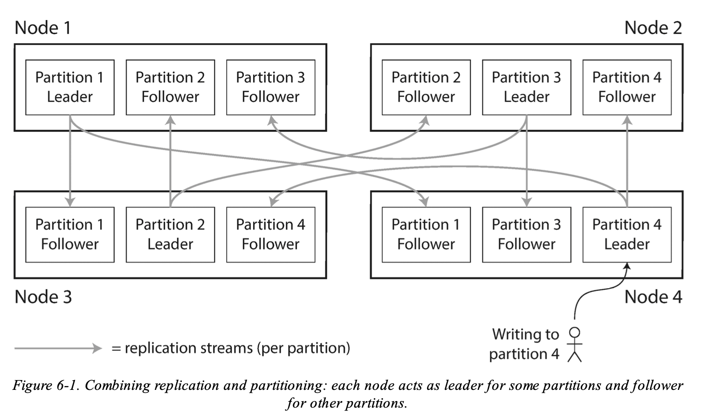
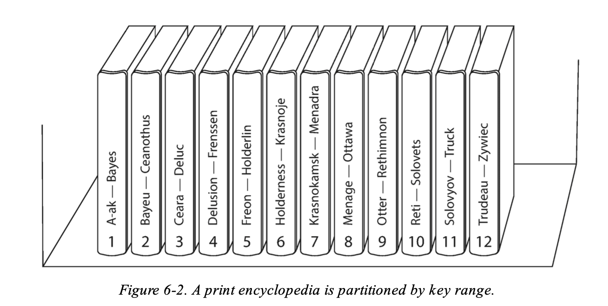
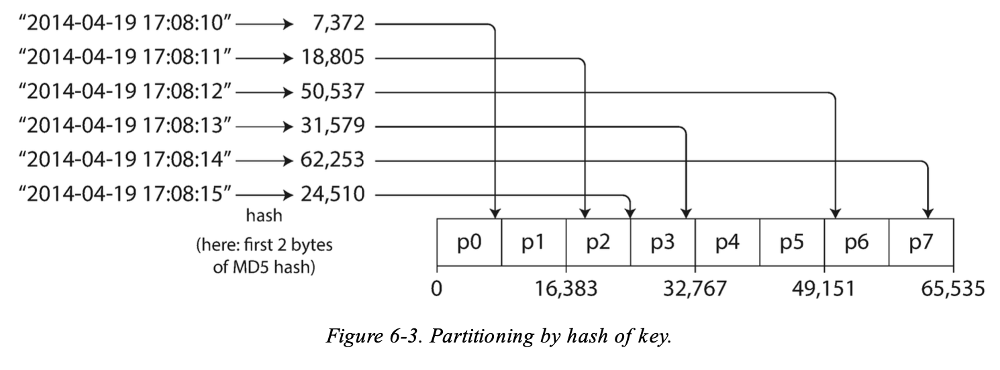
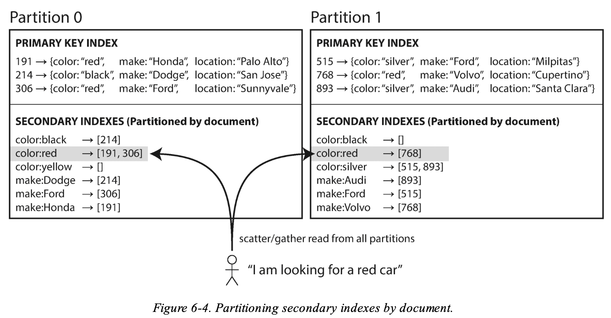
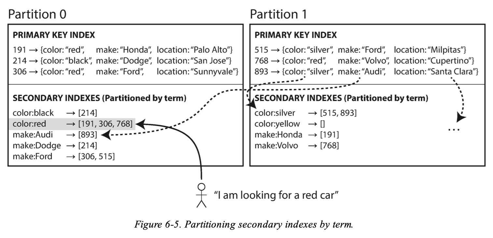
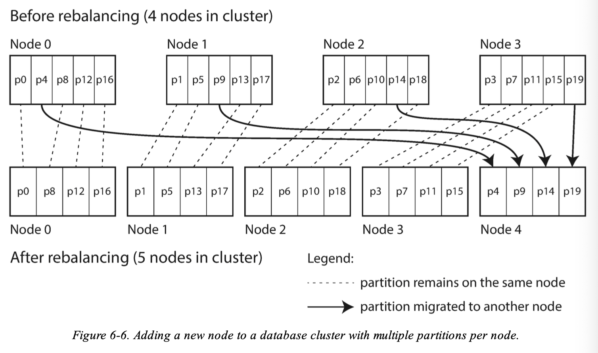
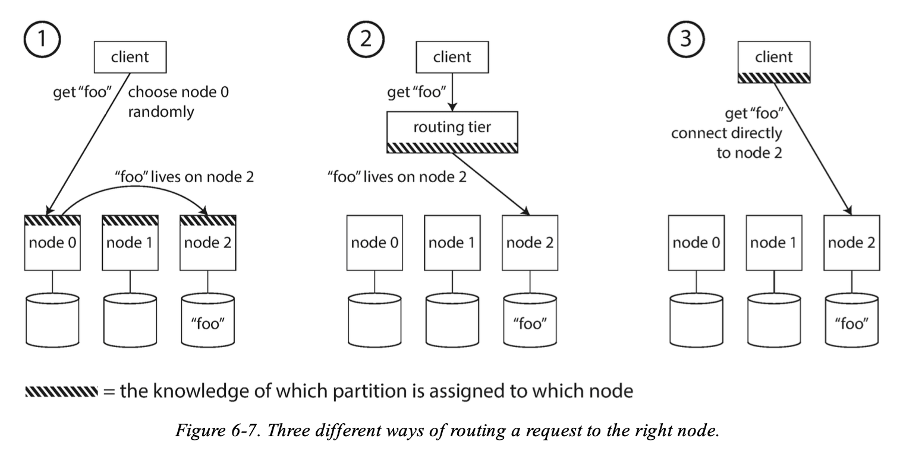

# Partitioning
Normally, partitions are defined in such a way that each piece of data (each record, row, or document) belongs to exactly one partition. 

> In effect, each partition is a small database of its own, although the database may support operations that touch multiple partitions at the same time.

## Partitioning and Replication
Partitioning is usually combined with replication so that copies of each partition are stored on multiple nodes. This means that, even though each record belongs to exactly one partition, it may still be stored on several different nodes for *fault tolerance*.

## Partitioning of Key-Value Data
* How do you decide which records to store on which nodes?

> Our **goal** with partitioning is to *spread the data and the query load evenly across nodes*.

### Skewed
Definition: 
* If the partitioning is unfair, so that some partitions have more data or queries than others, we call it skewed.

Problem with skews:
* The presence of skew makes partitioning much less effective. In an extreme case, all the load could end up on one partition, so 9 out of 10 nodes are idle and your bottleneck is the single busy node. 

### Hot spot
Definition:
* A partition with disproportionately high load

How to avoid hot spots:
* Assign records to nodes randomly
* **Disadvantage**: when you’re trying to read a particular item, you have no way of knowing which node it is on, so you have to query all nodes in parallel.
* To fix it we can do:
  * Partitioning by Key Range
  * Partitioning by Hash of key

### Partitioning by Key Range

Assign a continuous range of keys (from some minimum to some maximum) to each partition.

Advantage:
* If you know the boundaries between the ranges, you can easily determine which partition contains a given key. 
* If you also know which partition is assigned to which node, then you can make your request directly to the appropriate node.

Problem:
* The ranges of keys are not necessarily evenly spaced, because the data may not be evenly distributed.
* In order to distribute the data evenly, the partition boundaries need to adapt to the data.
  
### Partitioning by Hash of Key
A good hash function takes skewed data and makes it uniformly distributed.
> Say you have a 32-bit hash function that takes a string. Whenever you give it a new string, it returns a seemingly random number between $0$ and $2^{32} − 1$.
> * Even if the input strings are very similar, their hashes are evenly distributed across that range of numbers.

* For partitioning purposes, the hash function need not be cryptographically strong.

You can assign each partition a range of hashes (rather than a range of keys), and every key whose hash falls within a partition’s range will be stored in that partition.

Advantages:
* Good at distributing keys fairly among the partitions

Problem:
* We lose a nice property of key-range partitioning: the ability to do efficient range queries.
* Keys that were once adjacent are now scattered across all the partitions, so their sort order is lost.

### Skewed Workloads and Relieving Hot Spots
Hashing a key to determine its partition can help reduce hot spots.

However it can’t avoid them entirely:
* In the extreme case where all reads and writes are for the same key, you still end up with all requests being routed to the same partition.

## Partitioning and Secondary Indexes
A secondary index usually doesn’t identify a record uniquely but rather is a way of searching for occurrences of a particular value.

Examples:
* Find all actions by user 123,
* Find all articles containing the word hogwash,
* Find all cars whose color is red,
* and so on.

**Problem**:
* The problem with secondary indexes is that they don’t map neatly to partitions. 

**Approaches**:
* Document-based partitioning
* Term-based partitioning.

### Partitioning Secondary Indexes by Document
In this indexing approach, each partition is completely separate: each partition maintains its own secondary indexes, covering only the documents in that partition. 
* It doesn’t care what data is stored in other partitions.

Whenever you need to write to the database — to add, remove, or update a document — you only need to deal with the partition that contains the document ID that you are writing.

> **Example**:
> Imagine you are operating a website for selling used cars (illustrated in Figure 6-4 ). 
> Each listing has a unique ID — call it the document ID — and you partition the database by the document ID (for example, IDs 0 to 499 in partition 0, IDs 500 to 999 in partition 1, etc.).
>
> You want to let users search for cars, allowing them to filter by color and by make, so you need a secondary index on `color` and `make`.
> * In a document database these would be fields
> * In a relational database they would be columns
> If you have declared the index, the database can perform the indexing automatically

**Scatter/gather**
In the example above red cars appear in both partition 0 and partition 1.
Thus, if you want to search for red cars, you need to send the query to all partitions, and combine all the results you get back.

This is known as scatter/gather and it can *make read queries* on secondary indexes quite *expensive*.

* Even if you query the partitions in parallel, scatter/gather is prone to tail latency amplification.

### Partitioning Secondary Indexes by Term
Rather than each partition having its own secondary index (a *local index*), we can construct a *global index* that covers data in all partitions.

However:
* We can’t just store that index on one node, since it would likely become a bottleneck and defeat the purpose of partitioning. A global index must also be partitioned, but it can be partitioned differently from the primary key index.

**Example**:

> Red cars from all partitions appear under `color:red` in the index, but the index is partitioned so that colors starting with the letters a to r appear in partition 0 and colors starting with s to z appear in partition 1. The index on the make of car is partitioned similarly (with the partition boundary being between f and h ).

This kind of **index term-partitioned**, because the term we’re looking for determines the partition of the index.
* From the example above a term would be `color:red`.

**Advantage of using a global term index**
* It can make reads more efficient.
* Rather than doing scatter/gather over all partitions, *a client only needs to make a request to the partition containing the term that it wants*.

**Problem of using a global term index**
* Writes are slower and more complicated
* Because a write to a single document may now affect multiple partitions of the index (every term in the document might be on a different partition, on a different node)

## Rebalancing partitions
Over time, things change in a database:
* The query throughput increases, so you want to add more CPUs to handle the load.
* The dataset size increases, so you want to add more disks and RAM to store it.
* A machine fails, and other machines need to take over the failed machine’s responsibilities.
All of these changes call for data and requests to be moved from one node to another. 
The process of moving load from one node in the cluster to another is called *rebalancing*.

**Minimum requirements**:
* After rebalancing, the load (data storage, read and write requests) should be shared fairly between the nodes in the cluster.
* While rebalancing is happening, the database should continue accepting reads and writes.
* No more data than necessary should be moved between nodes, to make rebalancing fast and to minimize the network and disk I/O load.

### Strategies for rebalancing

**How to not do it!**
* Don't use % (mod)!
For example, hash (key ) mod 10 would return a number between 0 and 9 (if we write the hash as a decimal number, the hash mod 10 would be the last digit). If we have 10 nodes, numbered 0 to 9, that seems like an easy way of assigning each key to a node.

Why?:
* The problem with the mod N approach is that if the number of nodes N changes, most of the keys will need to be moved from one node to another.
* This results in making rebalancing excessively expensive.

> Example:
> * Say $hash(key) = 123456$. 
>* If you initially have 10 nodes, that key starts out on node 6 (because 123456 mod 10 = 6). 
>* When you grow to 11 nodes, the key needs to move to node 3 (123456 mod 11 = 3), 
>* and when you grow to 12 nodes, it needs to move to node 0 (123456 mod 12 = 0).

**Fixed number of partitions**
* Create many more partitions than there are nodes, and assign several partitions to each node.

> Example:
> * A database running on a cluster of 10 nodes may be split into 1,000 partitions from the outset so that approximately 100 partitions are assigned to each node.
> * If a node is *added* to the cluster, the new node can *steal* a few partitions from every existing node until partitions are fairly distributed once again.
> * If a node is *removed* from the cluster, the same happens in
reverse.

**Dynamic partitioning**
Problem:
* For databases that use key range partitioning, a fixed number of partitions with fixed boundaries would be very inconvenient: if you got the boundaries wrong, you could end up with all of the data in one partition and all of the other partitions empty.

Fix:
* For that reason, key range–partitioned databases create *partitions dynamically*.
* When a partition grows to exceed a configured size, it is split into two partitions so that approximately half of the data ends up on each side of the split.
* Conversely, if lots of data is deleted and a partition shrinks below some threshold, it can be merged with an adjacent partition.

How it works:
* Each partition is assigned to one node, and each node can handle multiple partitions, like in the case of a fixed number of partitions. 
* After a large partition has been split, one of its two halves can be transferred to another node in order to balance the load.

Advantage:
* The number of partitions adapts to the total data volume.
* If there is only a small amount of data, a small number of partitions is sufficient, so overheads are small.
* If there is a huge amount of data, the size of each individual partition is limited to a configurable maximum

**Partitioning proportionally to nodes**
Problem:
* With dynamic partitioning, the number of partitions is proportional to the size of the dataset, since the splitting and merging processes keep the size of each partition between some fixed minimum and maximum.
* On the other hand, with a fixed number of partitions, the size of each partition is proportional to the size of the dataset. 
* In both of these cases, the number of partitions is independent of the number of nodes.

Fix:
* Make the number of partitions proportional to the number of nodes.
* In other words, to have a *fixed number* of partitions *per node*.

## Request Routing
> When a client wants to make a request, how does it know which node to connect to?
> As partitions are rebalanced, the assignment of partitions to nodes changes. Somebody needs to stay on top of those changes in order to answer the question: if I want to read or write the key “foo”, which IP address and port number do I need to connect to?

**Approaches**:
1. Allow clients to contact any node (e.g., via a round-robin load balancer).
  * If that node coincidentally owns the partition to which the request applies, it can handle the request directly; otherwise, it forwards the request to the appropriate node, receives the reply, and passes the reply along to the client.
2. Send all requests from clients to a routing tier first, which determines the node that should handle each request and forwards it accordingly.
  * This routing tier does not itself handle any requests; it only acts as a partition-aware load balancer.
3. Require that clients be aware of the partitioning and the assignment of partitions to nodes.
  * In this case, a client can connect directly to the appropriate node, without any intermediary.

## Summary

### Main approaches to partitioning

**Key range partitioning**
* Where keys are sorted, and a partition owns all the keys from some minimum up to some maximum. 
* Sorting has the advantage that efficient range queries are possible, but there is a risk of hot spots if the application often accesses keys that are close together in the sorted order. 
* In this approach, partitions are typically rebalanced dynamically by splitting the range into two subranges when a partition gets too big.

**Hash partitioning**
* Where a hash function is applied to each key, and a partition owns a range of hashes. 
* This method destroys the ordering of keys, making range queries inefficient, but may distribute load more evenly. 
* When partitioning by hash, it is common to create a fixed number of partitions in advance, to assign several partitions to each node, and to move entire partitions from one node to another when nodes are added or removed. 
* Dynamic partitioning can also be used.
* Hybrid approaches are also possible, for example with a compound key: using one part of the key to identify the partition and another part for the sort order.

### Interaction between partitioning and secondary indexes

**Document-partitioned indexes (local indexes)**
* Where the secondary indexes are stored in the same partition as the primary key and value. 
* This means that only a single partition needs to be updated on write.
* But, a read of the secondary index requires a scatter/gather across all partitions.
* In short:
  * Good for writes (only one partition)
  * Bad for reads (scatter/gather)

**Term-partitioned indexes (global indexes)**
* Where the secondary indexes are partitioned separately, using the indexed values. 
* An entry in the secondary index may include records from all partitions of the primary key. 
* When a document is written, several partitions of the secondary index need to be updated.
* Wowever, a read can be served from a single partition.
* In short:
  * Good for reads (only one partition)
  * Bad for writes (need to write to several partitions)