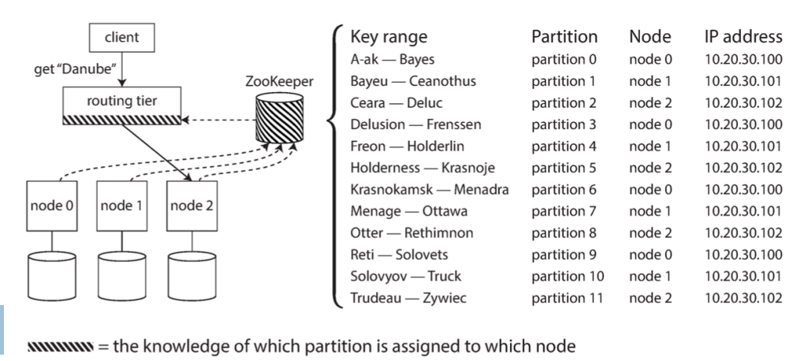

# Lecture 2 - Storing Big Data

## Store data in multiple machines
Why store data in multiple machines?
* Scalability
  * Increase the load
* Fault-tollerance/high availbaility
  * When machines fail (it will happen)
  * We want the system to be available
* Latency
  * Speed up performance
  * Many requests could be a bottleneck
  * Have machines closer geographically to the users

Quantifying load
* Load parameters
  * request/sec
  * reads vs writes in a DB
  * Number of simulattions
* Different statistical values can be used
  * Mean 
  * Median
  * Max
  * Percentiles

## Example from Twitter:
> 
> They have a challenges of certain users have a lot of followers, how do each follower get updated?

### Approach 1

* Difficult to keep up with the load of home timeline queries!
* Doing these join operations are very costly.

### Approach 2

* Difficult for users that are hotspots: have a very large fan-out degree!
* We sent the information multiple times.
* This approach prioritizes reads > writes.
  * Edge case: for celebrities as they will do many writes.

## Coping with load
**Scale up (Vertical scaling)**
* Upgrade machines
* Simplest solution
* Cost grows faster than linearly

**Scale out (Horizontal scaling)**
* Adding more (cheap) machines

## Quantifying performance
* **Throughput**
  * How many units of information a system can process in a given amount of time.
  * Number of records/data points/queries we can process per second 
* **Response time**
  * Time between user/client sending request and receiving response 
* **Latency**
  * Time to process a request

How to measure performance?

## Distributed systems architectures
* Shared memory
* Shared disk
* Shared nothing

### Shared memory architecture
* Technically, this is like a single machine

### Shared disk architecture

### Shared nothing architecture
* Most common architecture for Big data systems

## Distributed systems infrastructure deployments
On premises:
* **Cluster computing**: homogeneous commodity machines in a shared-nothing architecture connected via a local network, typically for large scale analysis

In the cloud:
* **Cloud computing**: machines connected via IP network, typically in geographically different locations, Internet services
* Private/Public/Hybrid

High performance computing (HPC):
* Interconnected supercomputers with multiple CPUs/GPUs in a disk-shared architecture, usually for computationally intensive scientific tasks

### Cloud computing service models

* Infrastructure as a Service (IaaS)
  * Provides rent out storage and computing capacities on their servers.
* Platform as a Service (PaaS) 
  * Rent platforms for software development
  * Windows Azure
* Software as a Service (SaaS)
  * Applications
  * Microsoft office
  * google drive

### Benefits of cloud computing
Everything should be managed by the company/organization

### Infrastructure as a Service (IaaS)

### Platform as a Service (PaaS)

### Software as a Service (SaaS)

### Cloud computing service models
At the layer of PaaS a new service is introduced called **Function as a Service** (**FaaS** or serverless).

### Cluster architecture

### Data center - typical cluster config

### Distributed system: Shared nothing architecture
A dataset arrives! How do we store it?

#### Partioning
> * Split data into (typically disjoint) subsets —> partitions 
> * Assign each partition to a different node (aka sharding)
> * Scalability

**Goal** of partitioning:
* Typically, we want to distribute the load evenly
* If a node receives much more data (skewed partitioning) than others, performance is decreased.
* **Hot spot**: a node/partition with disproportionately high load

**Simple idea**: randomly assign each data point to a node
* If you want to read a certain data point, how do you know where it is
located?

**Range partitioning**
* Assume you can have unique keys (key-value data model)
* Assign a continuous range of keys to each partition
* Sort keys within each partition
* Data may not be evenly distributed —> ranges might not be equally spaced because —> **hotspots**
* Boundaries can be chosen manually or automatically

> What would happen if we use a timestamp as the key?
> * I can reduce the search space to only one specific partition.
> * The problem is you need to know your workload and decide what to be the key.
> * Also if you only use timestamp as a key for example you have 10 nodes where each nodes covers 1 day of data. Then if you only need one day of data you only need one node, and the rest of the nodes are idle not doing anything --> waste of resources.

**Hash partitioning**
* Use a hash function on a key to determine the partition
* A good hash function will distributed keys evenly, even in the case of skewed data.
  * Hashing helps to deal with skew. However, if reads/writes are skewed your can still have hotspots.
* Inefficient for range queries

**Partitioning in Cassandra**
Hybrid model:
* Use composite key: (k1,k2)
* Hash partition on k1
* Index on k2 within a partition

#### Rebalancing partitions
* Things may change:
  * Query throughput increases —> add more resources
  * Dataset size increases —> add more resources
  * Machines fail —> add new machines 
* Move data from one node to another —> rebalancing/repartitioning 
* Typical requirements
   * After rebalancing, load should be evenly distributed
   * While rebalancing, system should continue to operate
   * Minimize the data movement, to minimise network and disk I/O load

**Rebalancing with fixed number of partitions**
* \# partitions >> \# nodes
* Each node has > 1 partition
* e.g., cluster with 10 nodes, 100 partitions per node
* If a new node is added, move partitions from other nodes until evenly distributed.

> The number of partitions does not change, nor does the assignment of keys to partitions. The only thing that changes is the assignment of partitions to nodes.

**Rebalancing with dynamic partitioning**
* Fits well for systems using range partitioning
* When a partition exceeds a configured fixed size, split it in two partitions
* Similarly, if a partition becomes too small (size below a configured threshold), merge it with another partition
* Nodes may sit idle when dataset too small to fit in 1 partition
  * Solution: pre splitting.

> \# partitions follows data volume

**Rebalancing proportionally to nodes**
* Fixed number of partitions per node
* For stable number of nodes, the size of partitions increases proportionally to the dataset size
* When adding a new node, the node chooses randomly partitions from other nodes to split and assigns half of them to itself
   * The size of partitions decreases

#### Request routing: how to get access to the right node
* 3 main strategies

Example with Zookeeper of a dynamic approach:
* Keeps cluster metadata
* Each node registers in Zookeeper
* Keeps mapping of partitions to nodes
* Services subscribe to Zookeeper keeping it up to date if ranges changes.

#### Replication
> * Keeping a copy of the same data on different nodes (potentially in different locations)
> * Availability
> * Why? Dataset changes!

**Leader based replication**
* Replica: a copy of the data
* How to ensure that all data ends up to all replicas?
* Synchronous replication
  * User make change --> The leader node update --> Send to follower node --> Follower sends ok --> Leader sends ok to user
  * Synchronous always has an up-to data copy
  * Problem with synchronous: bottleneck if the follower does not response (e.g. crashed)
* Asynchronous replication
  * User make change --> The leader node update --> Sent to follower node --> Assume that it will update at some point
  * Higher write throughtput
  * Weak durability (a write may be lost)
  * 

**Replication lag**
* Asynchronous follower that has fallen behind —> stale results —>
inconsistency
* Eventual consistency: database will be consistent at some time
* Stricter consistency models exist

##### Problems with replication lag
**Read your own writes consistency**
* Problem: A user makes a write, followed by a read from a stale replica
* Possible solution: Read from leader
* Other idea: implement some kind of clock to keep track of when reads and writes are done to prevent the order of execution.

**Monotonic reads consistency**
* Problem: A user first reads from a fresh replica, then from a stale replica
* Possible solution: Read from the same replica.

**Consistent prefix reads**
* Problem: The order of events seems twisted
* Possible solution: Write writes that are related to the same partition

#### Approaches to replication
**Single-leader replication**
* Writes to the leader
* Reads from any replica

**Multi-leader replication**
* Writes to any of the multiple leaders
* Reads from any replica

**Leaderless replication**
* Write to several nodes
* Read from several nodes in parallel to update stale data 

